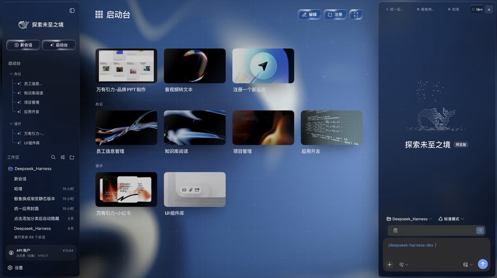
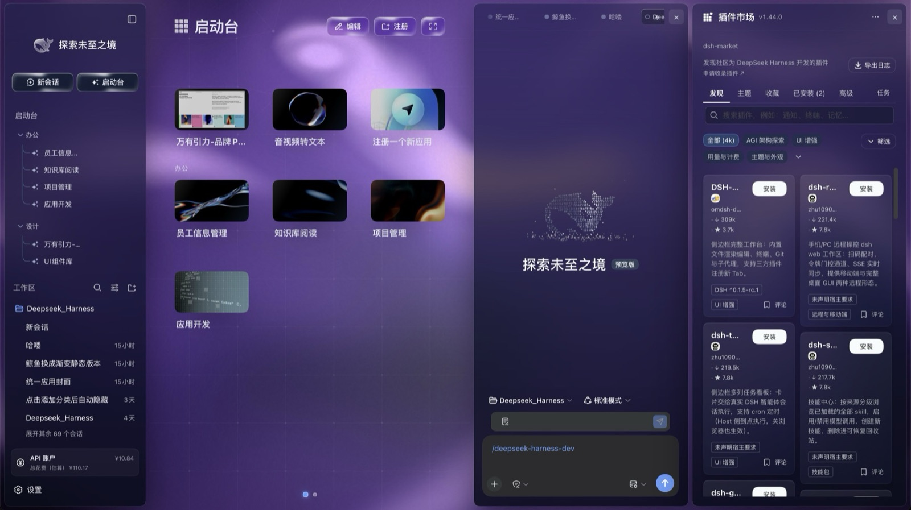
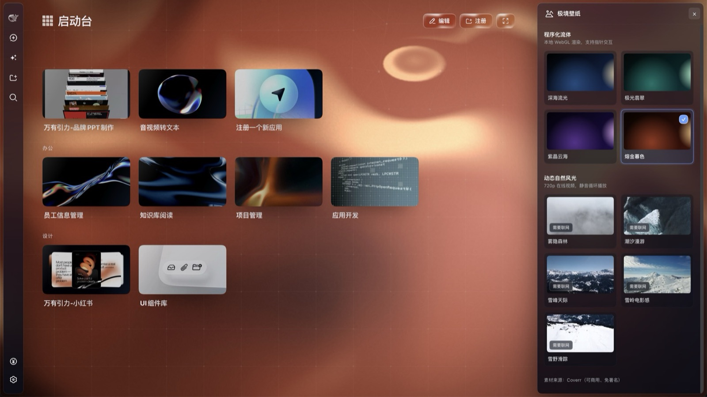
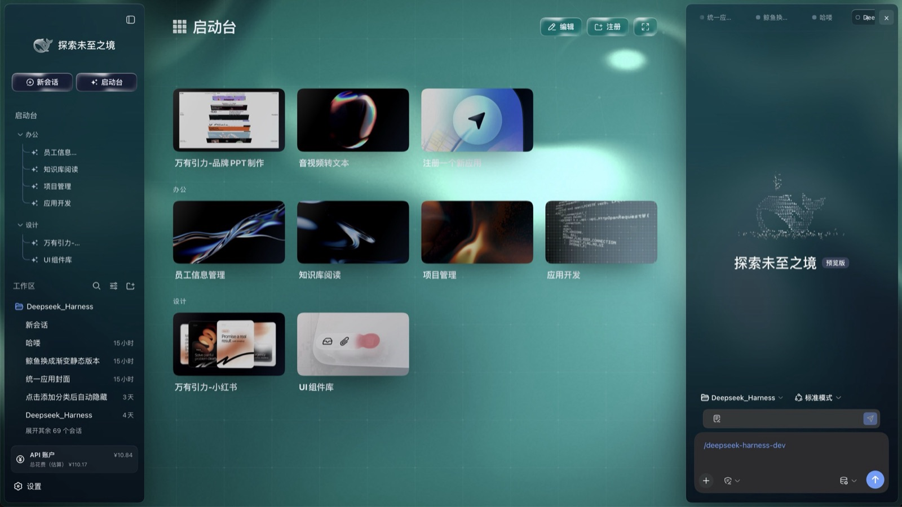
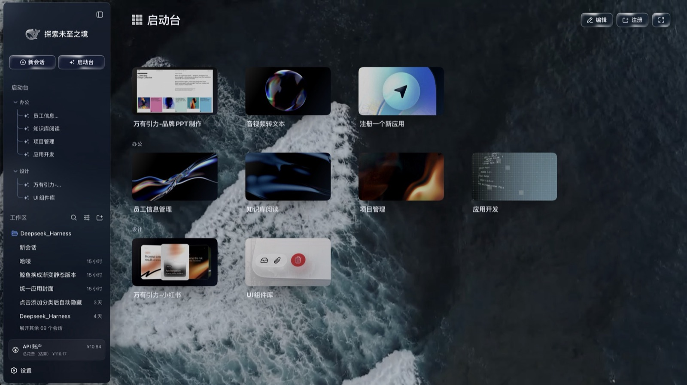
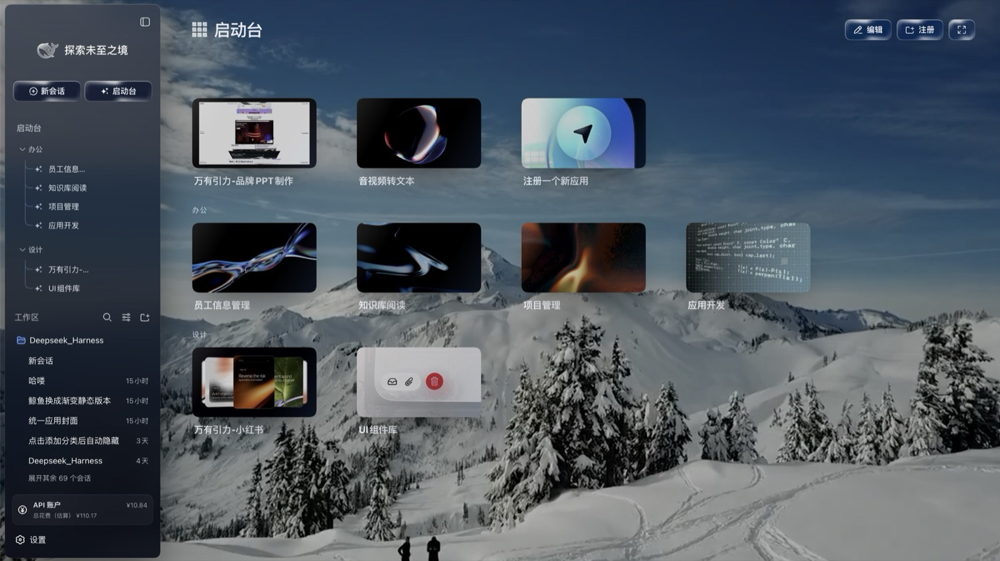
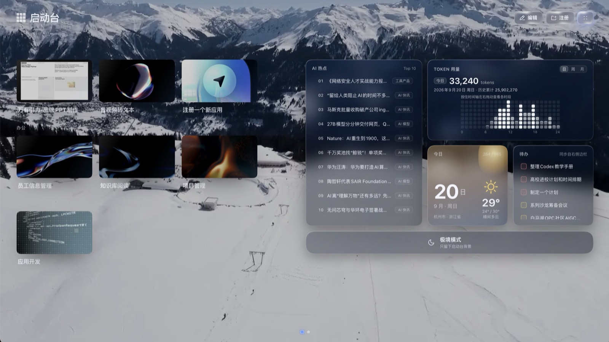
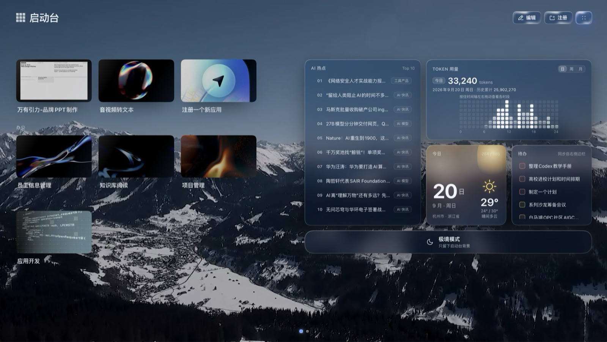

# Beyond Glass

A three-column glass UI for [deepseek-harness](https://github.com/deepseek-ai/deepseek-harness),
delivered as **a set of installable packages**. No fork, no patching: six packages mount into
a profile of their own, and removing them puts you back where you started.

[中文说明 →](README.zh.md)

**[Live gallery →](https://leoethanz.github.io/dsh-beyond-glass/)** — all nine wallpapers in one
page, switchable, with the fluid field running live around the frame. The window plays nine
seconds of the shell on the way in — folding a column away, changing wallpaper, switching on
the data island — and hands straight back to a still. Scroll back up to it, or try another
wallpaper and return to that one, and it plays again.



- [The three blocks](#the-three-blocks)
- [Design](#design)
- [Install](#install): [no harness yet](#no-harness-yet) / [the harness is already installed](#the-harness-is-already-installed)
- [What is in the packages, what is not](#what-is-in-the-packages-what-is-not)
- [Compatibility](#compatibility) · [License](#license)

## The three blocks

| Block | What it is | Packages |
| --- | --- | --- |
| **Glass shell** | The three-column frame — brand rail, left column, right column, all on translucent panels | `ui-layout` `ui-sidebar` `ui-sidebar-right` |
| **Launcher** | The centre panel of the home view: category grid, app cards, and the dashboard behind immersive mode | `ui-workbench` |
| **Wallpaper** | The wallpaper picker in the right column, plus the glass token sheet every panel reads | `ui-wallpaper` |

Only the `harness` package is a profile layer; the other five are mounted by the rows it patches.

## Design

### The glass shell

The left column carries identity and navigation (brand wordmark, new-session / launcher,
category tree, session list, API account). The centre is the launcher. The right column is the
current workspace: sessions, wallpaper, and whatever other panels register into it. All three sit
on one set of glass tokens — a translucent gradient, `backdrop-filter: blur(28px) saturate(1.8)`,
and a 0.5px outline.

The left column collapses to an icon rail, the right column folds away entirely, and the wallpaper
shows through underneath.


The right column is a workspace rather than a fixed panel: it can be sessions, it can be wallpaper,
it can be any panel another plugin registers into it (below: a plugin market).



### Wallpaper

The 极境壁纸 panel offers two families: **four procedural fluids** (深海流光, 极光翡翠, 紫晶云海,
熔金暮色) and **five motion landscapes** (雾隐森林, 潮汐漫游, 雪峰天际, 雪岭电影感, 雪野滑踪).

The fluids are drawn in the page and need no network. The landscapes are video and need a network
on first play (the panel marks them 需要联网). Footage from [Coverr](https://coverr.co/) —
free for commercial use, no attribution required.



<p>
  
  
  
</p>

### Launcher and dashboard

The centre panel lays app cards out by category (cover art, hover motion), with edit and register
entries and paging. **Immersive mode** puts the dashboard in the right half — four cards:

| Card | Content |
| --- | --- |
| **AI 热点** | A top-10 of headlines with category tags; the feed ships with the packages |
| **TOKEN 用量** | Today's and lifetime token counts, switchable by day / week / month, read from your own local usage |
| **今日** | Date plus local weather: city, temperature, high/low, condition |
| **待办** | Open to-dos, synced from the right column's to-do panel |



Wallpaper keeps working in immersive mode, with the dashboard over it:



Trending and weather are host-side feeds; to-dos share data with the right column's panel. Where
each of those stops is spelled out under
[what is in the packages, what is not](#what-is-in-the-packages-what-is-not).

## Install

You need Node.js, **pnpm**, and the `dsh` CLI (the first command below installs `dsh` if you do not
have it). Nothing else — no clone, no build. `dsh plugin` is a pnpm forwarder underneath, so pnpm
has to be on `PATH`; on Windows that is the one piece a fresh Node install leaves out.

All six packages go in **one** `add`, because only the `harness` package is a profile layer that
mounts the other five. Installing them one at a time works too, but only the last one is a layer
and the rest degrade to plain dependencies.

Every command below is written on a single line, so pasting it line by line works exactly as
well as pasting the block whole.

Each command is given twice: once for `bash`/`zsh`, once for Windows. The Windows block calls
`dsh.cmd` and uses no shell-specific syntax at all, so it runs unchanged in `cmd.exe` and in
PowerShell alike — bare `dsh` does not, because a default PowerShell policy blocks `dsh.ps1`.

### No harness yet

**macOS / Linux — `bash`, `zsh`**

```sh
npm install -g @deepseek-ai/dsh@0.1.5-rc.2

# create the profile first — delete it beforehand if it already exists
# (plain add leaves the profile with no app layer)
dsh --profile glass --from-default-profile web --dump-config

dsh plugin --profile glass add   https://github.com/LeoEthanZ/dsh-beyond-glass/releases/download/v0.1.3/beyond-glass-harness-0.1.6-alpha.2.tgz   https://github.com/LeoEthanZ/dsh-beyond-glass/releases/download/v0.1.3/beyond-glass-ui-layout-0.1.5-rc.2.tgz   https://github.com/LeoEthanZ/dsh-beyond-glass/releases/download/v0.1.3/beyond-glass-ui-sidebar-0.1.5-rc.2.tgz   https://github.com/LeoEthanZ/dsh-beyond-glass/releases/download/v0.1.3/beyond-glass-ui-sidebar-right-0.1.5-rc.2.tgz   https://github.com/LeoEthanZ/dsh-beyond-glass/releases/download/v0.1.3/deepseek-ai-dsh-client-ui-wallpaper-0.1.2-rc.1.tgz https://github.com/LeoEthanZ/dsh-beyond-glass/releases/download/v0.1.3/deepseek-ai-dsh-client-ui-workbench-0.1.2-rc.1.tgz

dsh --profile glass --port 0
```

**Windows — `cmd.exe` and PowerShell**

```bat
npm install -g @deepseek-ai/dsh@0.1.5-rc.2

# create the profile first — delete it beforehand if it already exists
# (plain add leaves the profile with no app layer)
dsh.cmd --profile glass --from-default-profile web --dump-config

dsh.cmd plugin --profile glass add   "https://github.com/LeoEthanZ/dsh-beyond-glass/releases/download/v0.1.3/beyond-glass-harness-0.1.6-alpha.2.tgz"   "https://github.com/LeoEthanZ/dsh-beyond-glass/releases/download/v0.1.3/beyond-glass-ui-layout-0.1.5-rc.2.tgz"   "https://github.com/LeoEthanZ/dsh-beyond-glass/releases/download/v0.1.3/beyond-glass-ui-sidebar-0.1.5-rc.2.tgz"   "https://github.com/LeoEthanZ/dsh-beyond-glass/releases/download/v0.1.3/beyond-glass-ui-sidebar-right-0.1.5-rc.2.tgz"   "https://github.com/LeoEthanZ/dsh-beyond-glass/releases/download/v0.1.3/deepseek-ai-dsh-client-ui-wallpaper-0.1.2-rc.1.tgz" "https://github.com/LeoEthanZ/dsh-beyond-glass/releases/download/v0.1.3/deepseek-ai-dsh-client-ui-workbench-0.1.2-rc.1.tgz"

dsh.cmd --profile glass --port 0
```

The `--from-default-profile web` step prints the composed profile tree — that is expected, and it
is why no block redirects output (every shell spells redirection differently). That line creates
`~/.dsh/profiles/glass` (`%USERPROFILE%\.dsh\profiles\glass` on Windows) carrying the same app
layer a stock `dsh web` profile has; `add` then puts the six packages on top. `glass` is just a
profile name — pick another if you like.

### The harness is already installed

Check the version first:

```sh
dsh --version      # needs 0.1.5-rc.2 or 0.1.6-alpha.2
```

If it matches, install — exactly as above, minus the harness install:

**macOS / Linux — `bash`, `zsh`**

```sh
# create the profile first — delete it beforehand if it already exists
# (plain add leaves the profile with no app layer)
dsh --profile glass --from-default-profile web --dump-config

dsh plugin --profile glass add   https://github.com/LeoEthanZ/dsh-beyond-glass/releases/download/v0.1.3/beyond-glass-harness-0.1.6-alpha.2.tgz   https://github.com/LeoEthanZ/dsh-beyond-glass/releases/download/v0.1.3/beyond-glass-ui-layout-0.1.5-rc.2.tgz   https://github.com/LeoEthanZ/dsh-beyond-glass/releases/download/v0.1.3/beyond-glass-ui-sidebar-0.1.5-rc.2.tgz   https://github.com/LeoEthanZ/dsh-beyond-glass/releases/download/v0.1.3/beyond-glass-ui-sidebar-right-0.1.5-rc.2.tgz   https://github.com/LeoEthanZ/dsh-beyond-glass/releases/download/v0.1.3/deepseek-ai-dsh-client-ui-wallpaper-0.1.2-rc.1.tgz https://github.com/LeoEthanZ/dsh-beyond-glass/releases/download/v0.1.3/deepseek-ai-dsh-client-ui-workbench-0.1.2-rc.1.tgz

dsh --profile glass --port 0
```

**Windows — `cmd.exe` and PowerShell**

```bat
# create the profile first — delete it beforehand if it already exists
# (plain add leaves the profile with no app layer)
dsh.cmd --profile glass --from-default-profile web --dump-config

dsh.cmd plugin --profile glass add   "https://github.com/LeoEthanZ/dsh-beyond-glass/releases/download/v0.1.3/beyond-glass-harness-0.1.6-alpha.2.tgz"   "https://github.com/LeoEthanZ/dsh-beyond-glass/releases/download/v0.1.3/beyond-glass-ui-layout-0.1.5-rc.2.tgz"   "https://github.com/LeoEthanZ/dsh-beyond-glass/releases/download/v0.1.3/beyond-glass-ui-sidebar-0.1.5-rc.2.tgz"   "https://github.com/LeoEthanZ/dsh-beyond-glass/releases/download/v0.1.3/beyond-glass-ui-sidebar-right-0.1.5-rc.2.tgz"   "https://github.com/LeoEthanZ/dsh-beyond-glass/releases/download/v0.1.3/deepseek-ai-dsh-client-ui-wallpaper-0.1.2-rc.1.tgz" "https://github.com/LeoEthanZ/dsh-beyond-glass/releases/download/v0.1.3/deepseek-ai-dsh-client-ui-workbench-0.1.2-rc.1.tgz"

dsh.cmd --profile glass --port 0
```

**This UI installs into a profile of its own.** Your existing profile — same plugins, same
settings — is not touched, and your `dsh` keeps working the way it did. Reach this UI with
`dsh --profile glass`; keep typing your usual command to reach yours.

The last line prints the address to open — `dsh web: http://127.0.0.1:<port>/?token=...`. `--port 0`
lets the OS pick a free port, so this profile never collides with a `dsh web` you already have
running. Your own profile keeps its own port; the two coexist.

Three things to watch:

- **Do not reuse a profile name you already have.** When the name is taken, `add` stacks onto that
  daily profile instead of creating a new one. Pick an unused name (the examples use `glass`).
- **On any other harness version** this UI is untested. Pin to a tested one first:
  `npm install -g @deepseek-ai/dsh@0.1.5-rc.2`.
- **`dsh --profile glass` printing nothing** means the profile was built by `add` alone and has no
  app layer in it. Delete `~/.dsh/profiles/glass` and run the whole block above again — the profile
  creation line is what makes it boot.

### Remove

**macOS / Linux — `bash`, `zsh`**

```sh
dsh plugin --profile glass remove   @beyond-glass/harness @beyond-glass/ui-layout @beyond-glass/ui-sidebar   @beyond-glass/ui-sidebar-right @deepseek-ai/dsh-client-ui-wallpaper @deepseek-ai/dsh-client-ui-workbench
```

**Windows — `cmd.exe` and PowerShell**

```bat
dsh.cmd plugin --profile glass remove   @beyond-glass/harness @beyond-glass/ui-layout @beyond-glass/ui-sidebar   @beyond-glass/ui-sidebar-right @deepseek-ai/dsh-client-ui-wallpaper @deepseek-ai/dsh-client-ui-workbench
```

That removes `dsh --profile glass`; delete `~/.dsh/profiles/glass`
(`%USERPROFILE%\.dsh\profiles\glass` on Windows) if you want the whole profile gone.

## What is in the packages, what is not

### In the packages

- The three-column frame, the left column, the right column, and the glass token sheet they share.
- The launcher: category grid, app-card look and motion, edit and register entries, paging.
- The launcher's first-run contents: the nine cards the screenshots show, with their names,
  descriptions, cover art and both categories — a clean install opens on that same 启动台.
- Immersive mode and the dashboard's four cards — their look **and** their data paths.
- The wallpaper picker and both wallpaper families (fluids drawn in-page; landscapes shipped as video).
- The three host capabilities that make the above work on a **clean official host**: the trending and
  weather feeds, and the cover art the app cards and template previews display (without them: broken
  images and a card that never lands a value).

### Not in the packages

**The applications behind those cards.** The nine cards ship with the packages, but the apps they
open do not: brand PPT, audio-to-text, employee directory, knowledge-base reader, project
management, app development, Xiaohongshu, UI kit and the register entry are each apps and plugins of
their own. Opening an uncabled card answers 「应用已注册但未接入」 — registered with no application
behind it yet. This distribution provides the launcher as a container, how cards are drawn, and the
catalog they open on. What you can actually open depends on what you installed.

**The tool panels in the right column.** Plugin market, recolour, unified cover art and the like are
panels their own plugins register into the right column. This distribution provides the column and
two of its panels — **sessions** and **wallpaper**. The rest appear when you install them.

**Where the dashboard's content comes from.** The four cards are not the same kind of thing:

| Card | What is still on you |
| --- | --- |
| AI 热点 | Nothing. The feed ships with the packages, so it has content out of the box |
| TOKEN 用量 | Nothing. It reads your own local session usage |
| 今日 + weather | The host must be able to reach `whois.pconline.com.cn` (resolves the city from the egress IP) and `open-meteo.com` (the forecast). When it cannot, the card sits on 正在定位… and reports no error |
| 待办 | **You provide it.** The card syncs from the right column's to-do panel, and that panel and its data source are not in these packages — so on a clean host this card is empty |

Worth knowing about the weather card: it resolves the city from your **egress IP** and makes the
call **host-side**. Behind a proxy that may not be your city, or may not resolve at all — the card
then keeps its empty state.

## Compatibility

Built against `@deepseek-ai/dsh@0.1.5-rc.2`, verified on `0.1.6-alpha.2`.

A harness release that adds a row occupying one of the seats this UI registers would collide with
it: the client then fails to load with a single-line `Failed to load plugins` message and nothing
else renders. If that happens, the fix lives in this distribution, not in your setup.

## License

MIT, as the harness it is built on. See [LICENSE](LICENSE) — the original copyright notice from
`deepseek-harness` is retained, and each package in the release carries a copy.
